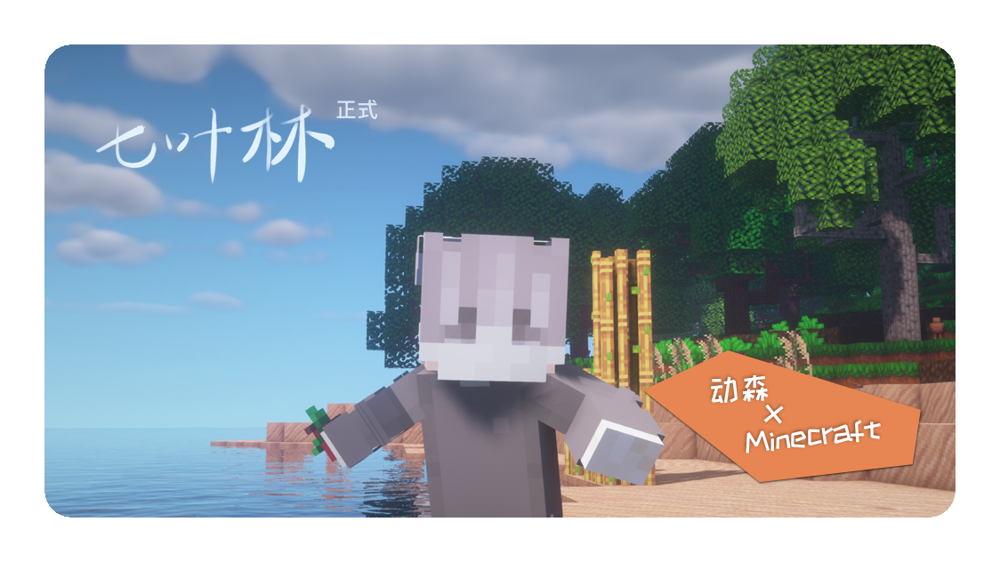

### 繁 荣 始 于 自 由

## 一群岛

## 一伙同伴   一顶帽子

## 一栋房子   一个部落

## 一只宠物   一窝小鸡

## 一位女仆   一颗树苗

## 一组季节   一场丰收

## 一把凿子   一个匠魂

## 一堆家具   一桶原油

## 一辆机车   一根石笋

## 一个世界

## 欢迎来到的奇妙世界

# 

## 七叶林是由桉树叶团队运营的**独立**服务器

## 它使用有机组合的**第三方模组**深度定制Minecraft

## 提供令人耳目一新的探索、休闲、创作体验

## **“休闲且耐玩”**

## 是打造七叶林的初衷

## 也是我们一直的追求

# 

 

## 如果你爱好**文明/家园**或类似游戏

## 如果你偏好**动物森友会/星露谷物语**或类似游戏

## 如果你喜好驾**驶模拟器**类游戏

## **那么你会喜欢七叶林的世界构建**

# 

+ ?> ## 提交[**`居民审核申请`**](https://eumc.typeform.com/to/gzLNAl)加入七叶林

+ ?> ## 建议阅读[**`快速入门`**](post/getting-start.md)板块进一步了解七叶林

+ ?> ## 想要详细了解七叶林 **`MODSPACK`**?请查阅[**`模组指南`**](post/mod-guide.md)板块

+ ?> ## 若你还有疑惑之处，请查阅[**`疑难解答`**](post/FAQ.md)