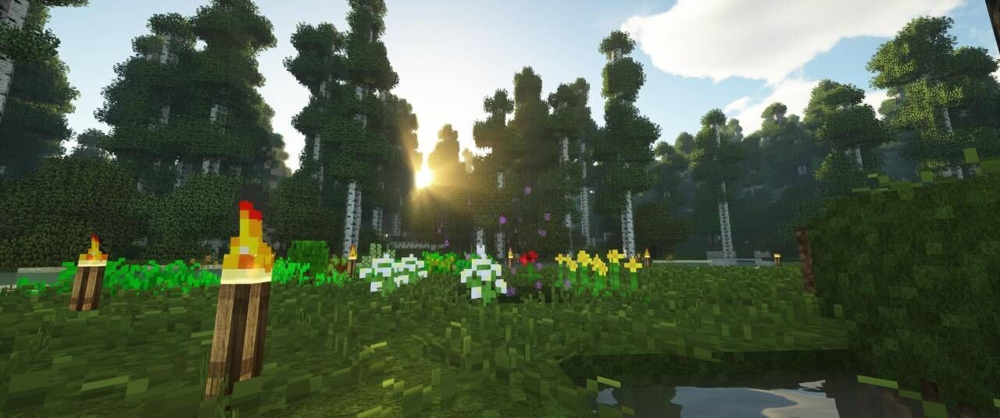

# **七叶林 Blue Jacaranda**

?> 欢迎小伙伴来到EusMC子项目七叶林(Blue Jacaranda)的网站！你可以随心所欲地阅读这些板块和文章，如果你发现了不正确的地方，麻烦你将准确的位置提供给**`EusMC团队`**，我们会第一时间处理问题哒！

## - 接下来我该做什么？

?> 我们建议你先阅读[**`快速入门`**](post/getting-start.md)板块，先熟悉了七叶林的基本要素，再参与七叶林项目的开发

?> 当你阅读完毕**`快速入门`**和**`规章制度`**板块后，你可以快乐地参与七叶林项目的开发了！

?> 如果你对七叶林**`Mod Pack`**中的模组不了解，你可以阅读[**`模组指南`**](post/mod-guide.md)板块

?> 若你还有疑惑之处，请到[**`疑难解答`**](post/FAQ.md)板块

