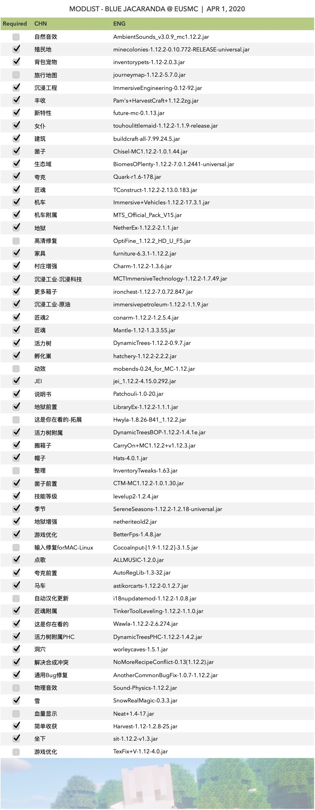

# **模组指南**

?> 本板块将会列出七叶林现阶段的模组清单并提供一些重要模组的玩法、攻略

## - 模组清单

!>为了保证体验质量，我们强烈建议您使用我们提供的**完整ModPack**。

## - 关键模组介绍

### 我的殖民地: MineColonies

MineColonies是一个**互动性很强**的的**部落**模组，允许玩家在Minecraft中创建自己的**繁荣城镇**。

### 丰收工艺: Pam's HarvestCraft

包含上千种食材，享受午后田园风光。

### 沉浸工程: ImmersiveEngineering

该模组具有极其精细的材质，以及具有重工业风格的多块结构建模。 同时，新增加的电缆系统和勘探系统也非常有趣。

